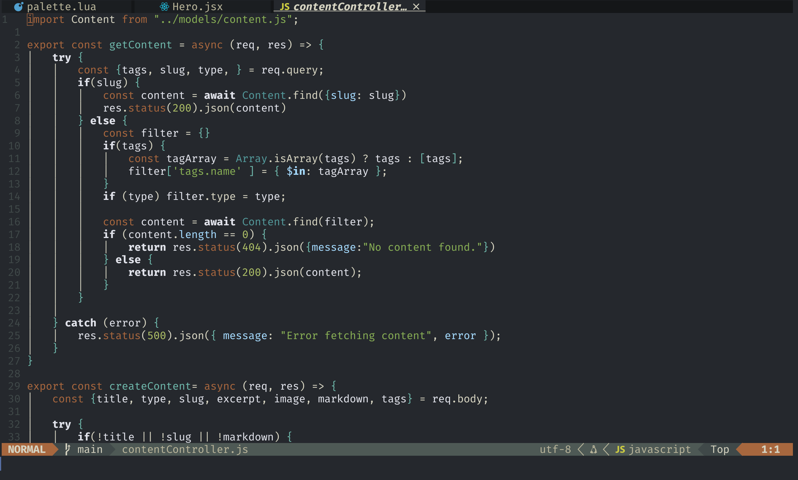

# Atrolite

Atrolite is a desaturated, simplistic color scheme for NVim inspired by
the [Atropoeia theme](https://lospec.com/palette-list/atropoeia). It provides
basic integration with `lualine.nvim` and `nvim-tree`.

## Screenshot



## Installation

#### lazy.nvim 
```lua
{
  "vex-i/atrolite.nvim",
  lazy=false,
  priority=1000,
}
```

